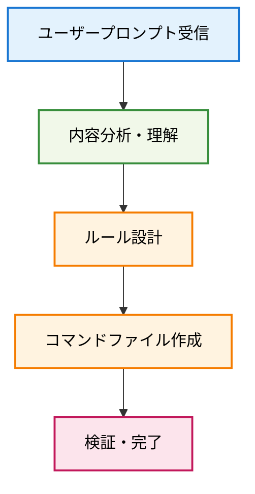

# Create Command

$ARGUMENTS 

作成したいコマンドの内容を指示します。

$ARGUMENTS には、作成したいコマンドの詳細な内容が指示されます。
この内容と、今対応しているセッション、会話のコンテキストと合わせて、Claude Code のカスタムスラッシュコマンドを作成してください。

指示が無いばあいは、今対応しているセッション、会話のコンテキストからコマンドの内容を考え、Claude Code のカスタムスラッシュコマンドの作成を提案します。

## 🎯 基本原則: 適切なClaudeルール作成

**ユーザーからの追加プロンプトを受信し、それに応じた適切なClaudeコマンドルールを作成・ファイル化します。**

## 📊 コマンド作成プロセス



## 🚀 実行手順

### 1. プロンプト内容の理解

ユーザーからの追加プロンプトを受信したら：

- プロンプトの目的と意図を分析する
- 求められている動作や機能を明確化する
- 適切なコマンド名を決定する（例：`deploy-check`、`code-review`、`test-runner`など）

### 2. ルール構造化

受信した内容を基に：

- Claude Codeの行動指針として構造化する
- 具体的で実行可能な手順に分解する
- 必要に応じて条件分岐や注意事項を含める
- 既存の`next-pr.md`のような形式に従う

### 3. コマンドファイル作成

- `.claude/commands/` ディレクトリに新しい`.md`ファイルを作成
- ファイル名は機能を表す分かりやすい名前にする
- マークダウン形式で見やすく構成する
- 他のコマンドファイルとの一貫性を保つ

### 4. 品質チェック

作成したコマンドファイルについて：

- 指示が明確で実行可能かを確認
- 必要な情報が含まれているかをチェック
- 既存コマンドとの整合性を検証

## 📝 作成コマンドの標準構造

作成されるコマンドファイルは以下の構造に従います：

````markdown
# [Command Name]

## 🎯 基本原則: [Core Principle]

**[Brief description of the command's purpose]**

## 📊 [適切な図表やフロー図]

```mermaid
[Workflow diagram if applicable]
```

## 🚀 実行手順

### 1. [Step Name]

[Detailed instructions]

### 2. [Step Name]

[Detailed instructions]

## 📝 使用例

[Practical examples]

## ⚠️ 注意事項

- [Important considerations]
- [Limitations]

## 📚 関連情報

- [Related commands or references]
````

## ⚡ 自動化トリガー

ユーザーから次のようなプロンプトを受信した場合、即座にコマンド作成を開始：

- "新しいコマンドを作成して: [内容]"
- "[機能名] のルールを作成"
- "以下の作業を自動化したい: [詳細]"
- その他、明確に新しいルールや手順の作成を求める内容

## 🎯 待機状態

**現在、ユーザーからの追加プロンプトを待機中です。**

次のメッセージで新しいルールの作成要求を受信した場合：

1. 内容を即座に分析
2. 適切なコマンド名を決定
3. ルールを構造化して`.claude/commands/`に保存
4. 作成完了を報告

準備完了 - コマンド作成プロンプトをお待ちしています 🚀
