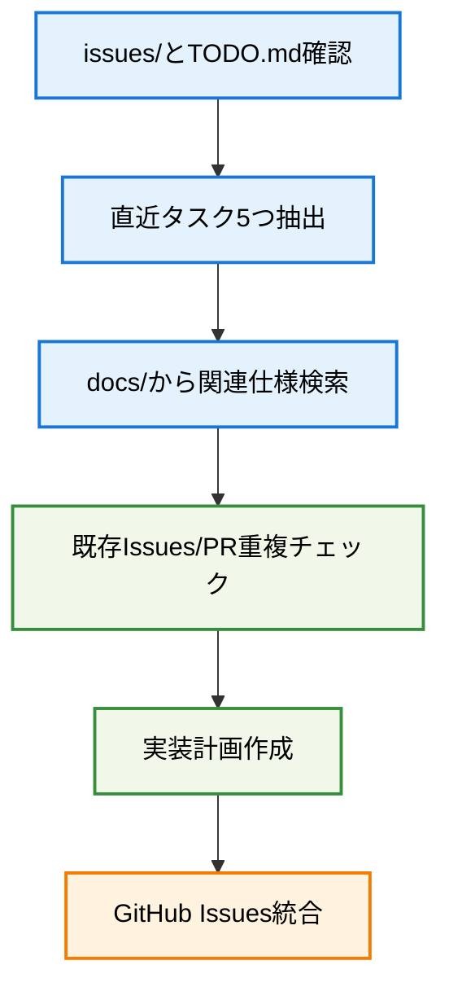

# create-task-issues

## 🎯 基本原則: プロジェクトタスク管理統合コマンド

**issues/とTODO.mdを分析し、直近タスクを抽出してGitHub Issues管理システムと統合します。**

## 📊 コマンド実行フロー



## 🚀 実行手順

### 1. プロジェクト状況分析

**タスク抽出源**:
- `issues/` フォルダ内のFeature Request仕様
- `TODO.md` の優先タスクリスト
- 現在のブランチ・開発状況

**抽出基準**:
- 実装準備が整っているタスク
- 依存関係が解決済みのタスク  
- 優先度が高く緊急性のあるタスク

### 2. 関連仕様の調査

**検索対象**:
- `docs/` ディレクトリ内の技術仕様
- アーキテクチャ設計文書
- UI/UXレイアウト定義

**収集情報**:
- 実装要件・制約事項
- 技術的詳細・設計パターン
- テスト要件・受け入れ基準

### 3. 重複チェック・関連付け

**チェック対象**:
```bash
gh issue list --state all --limit 20
gh pr list --state all --limit 10
```

**関連付けルール**:
- 同一機能の重複Issue回避
- 部分実装済PRとの適切な関連付け
- 上位互換チケットでの対応済み確認

### 4. 実装計画策定

**各タスクについて以下を定義**:
- **作業内容**: 具体的な実装ステップ
- **受け入れ基準**: 完了判定条件
- **見積**: 実装工数・期間
- **依存関係**: 前提条件・ブロッカー
- **リソース要件**: CPU・メモリ・技術要件

### 5. GitHub Issues統合

**新規Issue作成時の情報**:
- 実装計画をベースとした詳細description
- 適切なラベル・マイルストーン設定
- 関連PR・Issue番号の参照リンク

**関連付け処理**:
- オープンPRとの関連issue番号設定
- 部分実装の切り出し・分割対応
- 依存関係チェーンの明確化

## 📝 出力形式

### タスク抽出結果
```markdown
## 📊 直近タスク5つの抽出結果

### 🎯 優先タスク
1. **FC-XXX: タスク名** - 状況・優先度
2. **FC-XXX: タスク名** - 状況・優先度
...

### 📋 重複チェック結果
- **Issues**: 既存/新規の判定
- **PRs**: 関連する実装状況

### 🚀 実装計画
各タスクの詳細計画と次アクション
```

## ⚠️ 注意事項

- **重複回避**: 既存Issue・PRとの重複を必ず確認
- **関連付け**: 部分実装済みPRとの適切な紐付け
- **優先度管理**: 依存関係・緊急度を考慮した順序付け
- **更新頻度**: プロジェクト状況変化に応じた定期実行

## 📚 関連情報

- `TODO.md` - プロジェクト全体タスク管理
- `issues/` - Feature Request詳細仕様
- `docs/` - 技術仕様・アーキテクチャ設計
- GitHub Issues/PRs - 開発進捗管理

---

このコマンドにより、プロジェクトの現状把握から実装計画策定、GitHub Issues管理まで一連のタスク管理プロセスを自動化・効率化します。