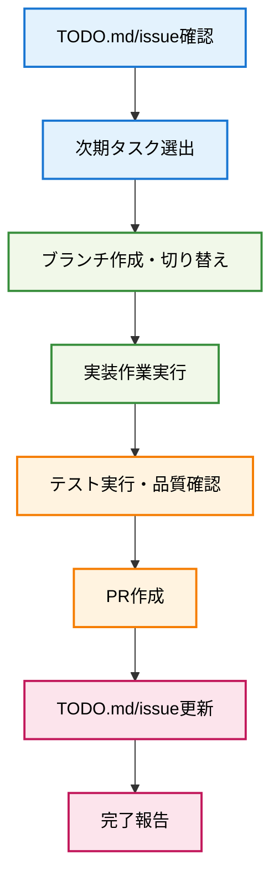

# Next Task Implementation

## 🎯 基本原則: 効率的なタスク進行とPR管理

**TODO.mdとissueから次のタスクを自動選出し、ブランチ作成から実装、PR作成、文書更新まで一貫して実行します。**

## 📊 タスク実装フロー



## 🚀 実行手順

### 1. タスク状況確認

現在の状況を確認：
- TODO.mdから次期優先タスクを特定
- 対応するissueファイルから詳細要件を確認
- 依存関係・前提条件をチェック
- 実装見積り・優先度を評価

### 2. ブランチ作成・環境準備

選出したタスクに対して：
- `feature/fc-xxx-task-name` 形式でブランチ作成
- メインブランチからの最新状態取得
- 開発環境の初期化・依存関係確認

### 3. 実装作業実行

タスクの詳細要件に基づいて：
- 新規モジュール・機能の実装
- 既存コードとの統合・拡張
- エラーハンドリング・ログ出力対応
- コード品質・規約遵守の確認

### 4. テスト・品質保証

実装完了後の検証：
- 単体テスト実装・実行
- 統合テスト・機能テスト実行
- コードフォーマット・リント実行
- ビルド・動作確認

### 5. PR作成・レビュー準備

実装完了時の手順：
- コミット・プッシュ実行
- **Issue関連付け**: PR説明文に`Closes #XX`または`Fixes #XX`を含めてissue自動クローズ設定
- 包括的なPR説明作成
- テスト結果・変更点サマリー
- レビュー観点・チェックリスト

### 6. 文書更新・完了処理

PR作成後の最終処理：
- **Issue状態更新**: 対象issueに進捗コメント追加・ラベル更新
- TODO.mdの該当タスクを完了マーク更新
- issueファイルの状況・完了日時更新
- 次期タスクの準備状況確認

#### Issue更新テンプレート
```
PR #XX で実装完了しました。

✅ **実装完了内容**:
- [主要機能1]
- [主要機能2] 
- [テスト結果]

**品質確認**: XX/XXテスト成功、既存テスト互換性維持
```

## 📝 タスク選出基準

### 優先度判定
1. **🟧 高**: 緊急・ブロッカー要素あり
2. **🟨 中**: 通常の開発フロー
3. **🟩 低**: 将来拡張・改善項目

### 依存関係チェック
- 前提タスクの完了状況確認
- 技術的依存関係の解決確認
- リソース・環境準備状況確認

### 実装可能性評価
- 要件の明確性・実装可能性
- 見積り工数と利用可能時間
- 技術的難易度・リスク評価

## 📋 現在の次期タスク状況

**FC-010: セッション間独立性**
- **優先度**: 🟧 高
- **見積**: 2.5 人日
- **依存**: FC-009完了 ✅
- **状態**: 実装準備完了

### 実装対象モジュール
1. **WorkingDirectoryManager**: 各ペイン専用ディレクトリ管理
2. **EnvironmentIsolation**: プロセス間環境変数独立化
3. **FileLockManager**: ファイルロック競合回避機構
4. **SessionStateManager拡張**: セッション状態完全分離

### 受け入れ基準
- 各ペインが独立した作業ディレクトリで動作
- 環境変数の変更が他ペインに影響しない
- 同一ファイルへの同時書き込みで競合が発生しない
- セッション履歴・設定が完全に分離される

## ⚠️ 注意事項

- ブランチ作成前に現在のワーキングディレクトリ状況を確認
- 実装中は定期的なコミット・プッシュを実行
- テスト失敗時は実装修正を優先
- **PR作成時は関連issueとのリンク設定必須**: `Closes #XX`でissue自動クローズ
- **PR完了後は対象issueに完了コメント追加**: 実装内容・テスト結果を報告

## 📚 関連情報

- `TODO.md`: 全タスク進捗管理
- `issues/FC-*.md`: 各タスクの詳細要件
- `.github/workflows/`: CI/CD設定
- `docs/process-architecture.md`: アーキテクチャ設計参照