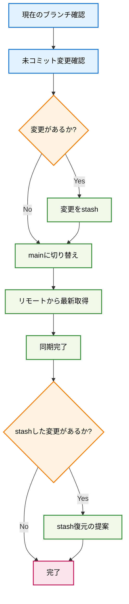

# Sync Main

## 🎯 基本原則: mainブランチへの安全な同期とクリーン状態の確保

**現在のワークスペースをmainブランチに移動し、リモートから最新情報を取得して同期状態を保つコマンドです。**

## 📊 同期プロセス



## 🚀 実行手順

### 1. 現在の状態確認

作業前に現在のブランチと変更状況を確認：

```bash
git status
git branch --show-current
```

### 2. 未コミット変更の保護

もし未コミットの変更がある場合は安全に保存：

```bash
# 変更がある場合のみ実行
git stash push -m "sync-main前の一時保存"
```

### 3. mainブランチへの切り替え

mainブランチに安全に移動：

```bash
git checkout main
```

### 4. リモートからの最新情報取得

リモートリポジトリから最新の変更を取得：

```bash
git pull origin main
```

### 5. 同期完了の確認

同期が成功したことを確認：

```bash
git status
git log --oneline -5
```

## 📝 使用例

### 基本的な使用法

```bash
# 現在のブランチから安全にmainに同期
/sync-main
```

### 実行結果例

```
✓ mainブランチに移動しました
✓ リモートから最新情報を取得しました
✓ 4件の新しいコミットを同期しました

最新のコミット:
f3b9bd4 新規ファイル作成: カスタムスラッシュコマンド作成手順
1957c57 新規ファイル作成: プロジェクトタスク管理手順
b7e91a9 新規ファイル作成: カスタムスラッシュコマンド作成手順
95ccfb8 FC-006: qa1/qa2ペイン対応実装完了
```

## ⚠️ 注意事項

- **未コミット変更の保護**: 重要な変更は事前にコミットまたはstashしてください
- **ブランチの確認**: 実行前に現在のブランチを確認してください
- **ネットワーク接続**: リモートリポジトリへの接続が必要です
- **権限確認**: リモートリポジトリへの読み取り権限が必要です

## 🔄 関連コマンド

- `git status` - 現在の状態確認
- `git stash list` - 保存された変更の確認
- `git stash pop` - 保存された変更の復元
- `/create-task-issues` - GitHub Issues作成
- `/create-command` - 新しいコマンド作成

## 📚 トラブルシューティング

### よくある問題と解決法

1. **マージコンフリクト発生時**
   ```bash
   git status  # コンフリクトファイル確認
   # 手動でコンフリクト解決後
   git add .
   git commit
   ```

2. **リモート接続エラー時**
   ```bash
   git remote -v  # リモート設定確認
   git config --list | grep remote  # 設定確認
   ```

3. **stash復元時のコンフリクト**
   ```bash
   git stash list  # stash一覧確認
   git stash show stash@{0}  # 変更内容確認
   git stash drop stash@{0}  # 不要なstashを削除
   ```