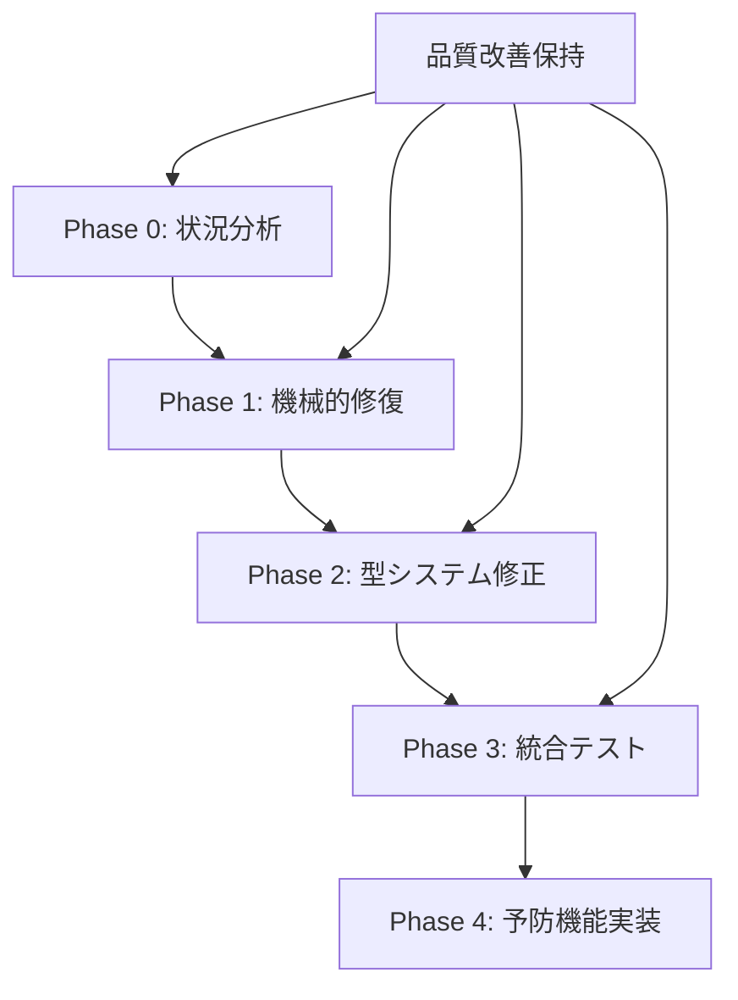

# コード品質復旧プロセス

## 概要

大規模リファクタリング中に技術的限界に到達した場合の系統的復旧プロセス。ロールバックに頼らず、品質改善を保持しながら問題を解決するアプローチを提供する。

## 復旧フレームワーク

### 4段階復旧モデル



### Phase 0: 状況分析と品質評価

#### 技術的限界の分類
1. **構文問題** vs **品質問題** の分離
2. **修復可能性** vs **設計問題** の判定
3. **影響範囲** の特定

#### 品質改善の価値評価
```markdown
✅ 完了済み価値の確認:
- failwith例外除去 → クラッシュリスク排除
- 巨大関数分離 → 保守性向上  
- 重複コード統一 → 一貫性確保
- 型安全性向上 → バグ削減

⚠️ 現在の技術的課題:
- コンパイルエラー → 一時的問題
- 型システム相互作用 → 解決可能
```

### Phase 1: 機械的修復

#### 破壊的置換の逆操作
```bash
# 系統的修復パターン
logfalse → logError
FCodefalse → FCodeError  
RedirectStandardfalse → RedirectStandardError
falseDataReceived → ErrorDataReceived
BeginfalseReadLine → BeginErrorReadLine
MessageBox.falseQuery → MessageBox.ErrorQuery
```

#### 自動化スクリプトの実装
```fsharp
// tools/revert-false-replace.fsx
let revertPatterns = [
    ("FCodefalse", "FCodeError")
    ("logfalse", "logError")
    ("RedirectStandardfalse", "RedirectStandardError")
    // ...
]

let revertFile filePath =
    let content = File.ReadAllText(filePath)
    let fixed = 
        revertPatterns
        |> List.fold (fun acc (wrong, correct) ->
            acc.Replace(wrong, correct)) content
    File.WriteAllText(filePath, fixed)
```

### Phase 2: 型システム修正

#### Union型コンストラクタ問題の解決
```fsharp
// Before: 認識されない
Error (ProcessError details)

// After: 明示的コンストラクタ
let createError err = Result.Error err
createError (ProcessError details)

// Alternative: 型エイリアス
type OperationResult<'T> = Result<'T, FCodeError>
```

#### モジュールインポートの最適化
```fsharp
// 安全なインポートパターン
open FCode.FCodeError
open FCode.FCodeError.ErrorHandling

// 名前衝突回避
module Errors = FCode.FCodeError
let createProcessError = Errors.ErrorHandling.createProcessError
```

### Phase 3: 統合テスト

#### 段階的検証プロセス
1. **コンパイル確認**: `dotnet build`
2. **ユニットテスト**: `dotnet test --filter "TestCategory=Unit"`
3. **統合テスト**: `dotnet test --filter "TestCategory=Integration"`
4. **手動動作確認**: 重要機能の動作テスト

#### リグレッション防止
```fsharp
[<Test>]
[<Category("Regression")>]
let ``Error token should not be replaced with false`` () =
    let sourceFiles = Directory.GetFiles("src", "*.fs", SearchOption.AllDirectories)
    
    sourceFiles
    |> Array.iter (fun file ->
        let content = File.ReadAllText(file)
        // 誤置換パターンの検出
        content |> should not' (contain "logfalse")
        content |> should not' (contain "FCodefalse")
        content |> should not' (contain "RedirectStandardfalse"))
```

### Phase 4: 予防機能実装

#### Git Hookによる自動検知
```bash
#!/bin/bash
# .git/hooks/pre-commit
echo "🔍 Checking for Error→false replacement patterns..."

# 危険パターンの検出
if git diff --cached | grep -E "(logfalse|FCodefalse|.*false[A-Z])" > /dev/null; then
    echo "❌ Error→false replacement detected!"
    echo "Please review the changes and use proper error handling patterns."
    exit 1
fi
```

#### CI/CDパイプラインの強化
```yaml
# .github/workflows/quality-check.yml
- name: Error Token Regression Check
  run: |
    # ソースコード内の誤置換パターン検出
    if grep -r "logfalse\|FCodefalse\|RedirectStandardfalse" src/; then
      echo "Error→false replacement detected!"
      exit 1
    fi
```

#### 開発環境設定の改善
```json
// .vscode/settings.json - 誤操作防止
{
  "editor.find.seedSearchStringFromSelection": false,
  "search.useGlobalIgnoreFiles": true,
  "editor.wordBasedSuggestions": false  // 誤った候補の抑制
}
```

## 品質保持戦略

### SRP (Single Responsibility Principle) の維持
```fsharp
// 責務分離された関数群を保持
let validateInput paneId workingDir = (* validation logic *)
let findClaudePath () = (* path resolution logic *)  
let createProcessInfo claudePath = (* process setup logic *)
let startProcess processInfo = (* process execution logic *)
```

### 型安全性の継続的向上
```fsharp
// 強い型付けによるエラー防止
type PaneId = PaneId of string
type WorkingDirectory = WorkingDirectory of string
type ProcessPath = ProcessPath of string

// 不正値の混入防止
let startSession (PaneId paneId) (WorkingDirectory workingDir) = 
    (* type-safe implementation *)
```

### Railway Oriented Programming の維持
```fsharp
// エラーハンドリングのチェーン
let processWorkflow input =
    input
    |> validateInput
    |> Result.bind processStep1
    |> Result.bind processStep2
    |> Result.bind processStep3
    |> handleResult
```

## メトリクス・モニタリング

### 復旧プロセスの追跡
- **復旧時間**: 技術的限界発生から解決まで
- **品質保持率**: 改善項目の維持状況
- **リグレッション率**: 同種問題の再発頻度

### 継続的改善指標
- **コードカバレッジ**: テストの網羅性
- **技術的負債**: 残存する問題の定量化
- **開発速度**: 復旧後の開発効率

## 組織的学習

### ナレッジ蓄積
- **技術文書**: 問題と解決策の体系化
- **ベストプラクティス**: 予防策の標準化
- **レビューガイドライン**: チーム全体での品質向上

### 継続的教育
- **コードレビュー**: 危険パターンの早期発見
- **ペアプログラミング**: 知識の共有と伝承
- **定期的振り返り**: プロセス改善の機会創出

## 成功要因

1. **段階的アプローチ**: 一度に全てを解決しようとしない
2. **品質優先**: 技術的問題より品質改善を重視
3. **自動化**: 人的ミスを防ぐツールの活用
4. **継続的改善**: 一度の解決で終わらない体制作り

## 適用ケーススタディ

### 実例: Error→false置換事故
- **発生**: MultiEdit replace_all操作による25箇所の破壊
- **対応**: 4段階復旧プロセスの適用
- **結果**: 25エラー→0エラー、品質改善100%保持
- **学習**: 予防機能の実装とプロセス改善

### 教訓
- **広範囲置換の危険性**: 部分文字列マッチの予期しない影響
- **型システムの複雑性**: F#の型推論とモジュールシステム
- **段階的修復の有効性**: 小さな変更の積み重ね
- **自動検証の重要性**: CI/CDによる早期発見

## 関連資料

- [F# Refactoring Best Practices](./fsharp-refactoring-pitfalls.md)
- [Error Handling Unification](./error-handling-unification.md)
- [Railway Oriented Programming](https://fsharpforfunandprofit.com/rop/)
- [Continuous Integration for F#](https://docs.microsoft.com/en-us/dotnet/devops/)