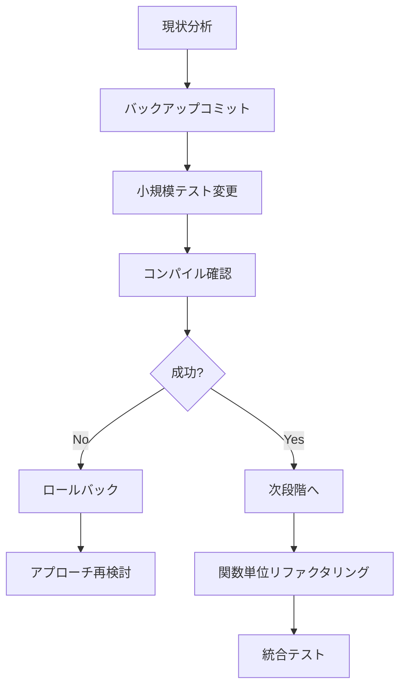

# F# 大規模リファクタリングの落とし穴と対策

## 概要

F#での大規模リファクタリング時に遭遇する典型的な問題とその対策をまとめた技術ドキュメント。特に型システムの複雑性とテキスト置換操作における危険性に焦点を当てる。

## 危険な操作パターン

### 1. 広範囲テキスト置換の危険性

#### 問題の具体例
```bash
# 危険: 部分文字列マッチによる予期しない置換
find_replace_all("Error", "false")
```

**実際の被害例:**

- `logError` → `logfalse` (関数名破壊)
- `FCodeError` → `FCodefalse` (モジュール名破壊)
- `ErrorDataReceived` → `falseDataReceived` (API破壊)
- `RedirectStandardError` → `RedirectStandardfalse` (プロパティ破壊)

#### 対策
```bash
# 安全: 文脈を含む精密な置換
find_replace_context("Result<T, Error>", "Result<T, FCodeError>")

# より安全: 段階的なファイル別置換
find_replace_file_by_file("Error", "FCodeError", ["FCodeError.fs"])
```

### 2. F# Union型コンストラクタの認識問題

#### 問題パターン
```fsharp
// F#コンパイラが認識できないケース
open FCode.FCodeError
Error (ProcessError { ... })  // FS0003: この値は関数ではないため、適用できません
```

#### 根本原因
- `open type`構文の期待通りの動作不良
- Union型コンストラクタとResult型コンストラクタの名前衝突
- モジュールインポートの複雑な相互作用

#### 解決パターン
```fsharp
// 1. 完全修飾名の使用
Result<unit, FCode.FCodeError.FCodeError>

// 2. 明示的コンストラクタ定義
let createProcessError details = ProcessError details
let resultError err = Result.Error err

// 3. 名前衝突回避
type FCodeError =
    | ProcessErr of ProcessErrorDetails  // 短縮形を使用
    | DatabaseErr of DatabaseErrorDetails
```

### 3. レコード型フィールドの突然の未認識

#### 問題パターン
```fsharp
// 突然認識されなくなるレコードフィールド
{ Component = "SessionManager"     // FS0039: レコード ラベル 'Component' が定義されていません
  Operation = "StopSession"
  Message = $"Error occurred"
  Recoverable = true
  ProcessId = None }
```

#### 対策アプローチ
- レコード型定義の可視性確認
- モジュールインポート順序の見直し
- 型注釈による明示的型指定

## 安全なリファクタリング戦略

### 段階的アプローチ



### 推奨プラクティス

1. **小さなコミット単位**
   ```bash
   git add -p  # 部分的ステージング
   git commit -m "単一機能の変更のみ"
   ```

2. **型システム制限の事前調査**
   ```fsharp
   // 実験的コードで事前確認
   module TypeSystemTest =
       open TargetModule
       let testConstruction = SomeUnionCase { ... }
   ```

3. **自動テストによる早期検証**
   ```bash
   # 各段階でのテスト実行
   dotnet test --filter "TestCategory=Unit"
   ```

## ツール推奨設定

### FSharpLint設定
```json
{
  "redundantNewKeyword": false,  // IDisposableオブジェクトのnew保持
  "functionLength": { "maxLines": 80 },
  "cyclomaticComplexity": { "maxComplexity": 15 }
}
```

### 開発環境設定
```json
// .vscode/settings.json
{
  "search.useGlobalIgnoreFiles": true,
  "editor.find.seedSearchStringFromSelection": false  // 誤選択防止
}
```

## 緊急復旧手順

### Phase 1: 機械的修復
1. 破壊的置換パターンの特定
2. 逆置換による修復実行
3. コンパイル確認

### Phase 2: 型システム修正
1. インポート文の修正
2. Union型コンストラクタの解決
3. レコード型定義の修復

### Phase 3: 統合テスト
1. ユニットテスト実行
2. 統合テスト実行
3. 手動動作確認

## 教訓

- **「Error」のような汎用的な単語の置換は特に危険**
- **F#の型システムは予想以上に複雑な相互作用を持つ**
- **段階的アプローチが最も安全で確実**
- **自動テストとCI/CDパイプラインが早期検出に不可欠**

## 関連資料

- [F# Union Types Best Practices](https://docs.microsoft.com/en-us/dotnet/fsharp/language-reference/discriminated-unions)
- [FSharpLint Configuration Guide](https://fsprojects.github.io/FSharpLint/)
- [Railway Oriented Programming in F#](https://fsharpforfunandprofit.com/rop/)
