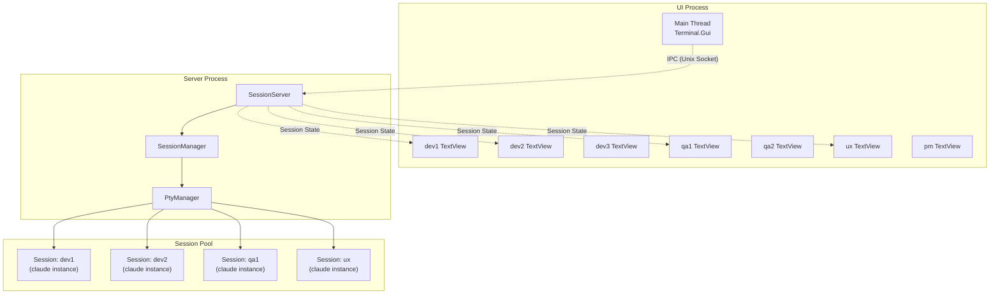
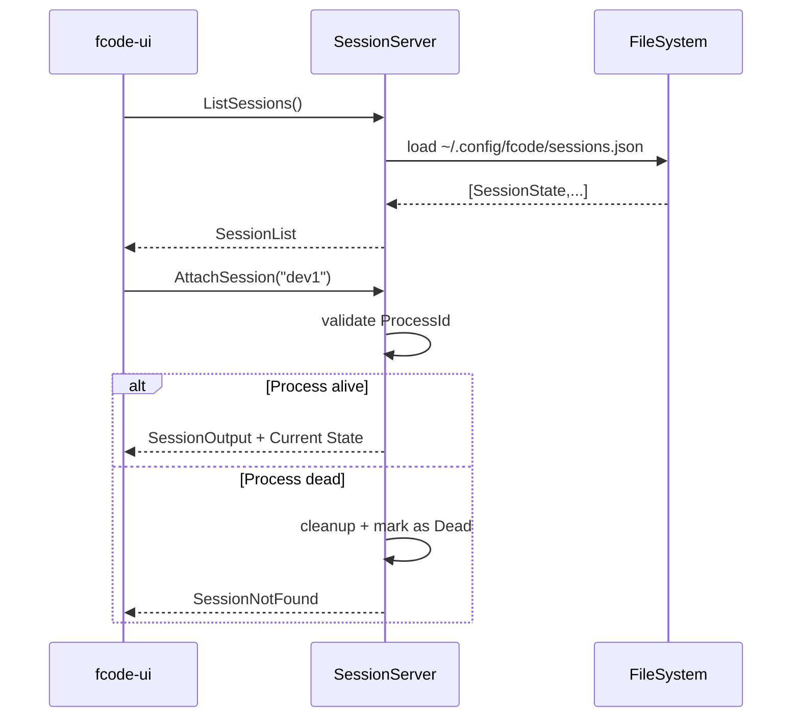

# PTY/TUI 統合アーキテクチャ設計書

## 1. はじめに

本ドキュメントは、fcode が **Claude Code** CLI を各ペインで多重起動する際に不可欠となる **疑似端末 (PTY)** および **TTY** 制御のアーキテクチャを詳述する。**tmux/screen の実証済み手法**を参考に、Terminal.Gui 上の TextView に curses 風 UI を安全かつ効率的に埋め込むことで、ユーザーは Claude Code のリッチな対話インターフェースを損なうことなく利用できる。

> 既存のプロセス分離設計 (docs/process-architecture.md) を補完する詳細設計である。

---

## 2. 【推奨ライブラリ構成】実装可能性の大幅改善

前途多難だった低レベルPTY実装について、**優秀な.NETライブラリの組み合わせ**により実装コストを大幅削減できることが判明した。

### 2.1 採用ライブラリ

#### **Microsoft Pty.Net** (PTY制御)
```xml
<PackageReference Include="Pty.Net" Version="2.0.0" />
```

- **Microsoft公式開発・保守** による信頼性
- **クロスプラットフォーム完全対応** (Linux/macOS/Windows)
- **F#/.NET完全互換**
- VS Codeの拡張機能で実績あり

**主要API:**
```fsharp
// PTYセッション作成
let options = PtyConnectionOptions(Name="dev1", Columns=80, Rows=24)
let! ptyConnection = PtyProvider.SpawnAsync("claude", [|"--chat"|], options)

// 入出力ストリーム
ptyConnection.ReaderStream  // 出力読み取り
ptyConnection.WriterStream  // 入力送信
ptyConnection.Resize(cols, rows)  // リサイズ
```

#### **System.IO.Pipelines** (ストリーム処理最適化)
```xml
<PackageReference Include="System.IO.Pipelines" Version="8.0.0" />
```
- **高性能な非同期ストリーム処理**
- PTY出力の効率的なバッファリング

#### **Microsoft.Extensions.Logging** (構造化ログ)
```xml
<PackageReference Include="Microsoft.Extensions.Logging" Version="8.0.0" />
```
- セッション管理・PTY操作の詳細ログ

### 2.2 実装戦略

**Microsoft Pty.Netによる簡潔な実装:**
```fsharp
type PtyManager(logger: ILogger) =
    member this.CreateSession(sessionId, command, args, workingDir) =
        task {
            let options = PtyConnectionOptions(
                Name = sessionId,
                Columns = 80, Rows = 24,
                WorkingDirectory = workingDir
            )
            let! pty = PtyProvider.SpawnAsync(command, args, options)
            return pty
        }
```

---

## 3. tmux/screen からの学習と適用

### 3.1 tmux アーキテクチャの採用

**tmux の実証済みパターン:**
```
┌─────────────────┐    Unix Socket    ┌──────────────────┐
│  fcode client   │◄──────────────────│  fcode server    │
│  (Terminal.Gui) │                   │  (Session管理)   │
└─────────────────┘                   └──────────────────┘
                                              │
                                              ▼
                                       ┌──────────────────┐
                                       │  PTY Sessions    │
                                       │  (claude instances) │
                                       └──────────────────┘
```

**fcode への適用:**
- **UIプロセス**: Terminal.Gui でユーザーインターフェースを担当
- **サーバープロセス**: セッション管理とPTY制御を担当
- **プロセス分離**: UI部分の障害がセッションに影響しない

### 3.2 セッション永続化の導入

**tmux/screen 準拠の機能:**
- **デタッチ/アタッチ**: UI終了後もセッションが継続
- **セッション復元**: fcode再起動時に既存セッションを復元
- **状態保存**: 作業ディレクトリ、環境変数、履歴の保持

---

## 4. ライブラリ導入による工期短縮

### 4.1 実装工期の大幅短縮

**従来予想 (生実装):**
- Phase 1-3: **8-10週間**
- 高いリスク (PTY制御の複雑性)

**ライブラリ活用後:**
- Phase 1-2: **4-5週間**
- リスク大幅軽減

### 4.2 具体的な改善項目

| 実装項目 | 従来工数 | ライブラリ活用後 | 削減効果 |
|----------|----------|------------------|----------|
| PTY制御実装 | 3週間 | **0.5週間** | -2.5週間 |
| ストリーム制御 | 1.5週間 | **0.5週間** | -1週間 |
| クロスプラットフォーム対応 | 2週間 | **0週間** | -2週間 |

**合計短縮: 約4週間**

### 4.3 品質向上

- **実績のあるライブラリ**: Microsoft Pty.NetはVS Code拡張で実用済み
- **十分なテストカバレッジ**: 既にライブラリ側で検証済み
- **メンテナンス負担軽減**: バグ修正・機能追加をライブラリ側に委ねられる

---

## 5. 用語集

| 用語 | 説明 |
|------|------|
| **TTY** | 端末デバイス (Teletype)。OS が行バッファリングやエコーバックを提供する。|
| **PTY** | 疑似端末 (Pseudo-TTY)。ユーザー空間で TTY 動作をエミュレートし、プロセス間で端末 I/O を中継する。Linux の `openpty(3)` など。|
| **master/slave** | PTY デバイスペア。master 側をアプリ (fcode) が保持し、slave 側を子プロセス (claude) が標準入出力として使用する。|
| **curses** | 端末制御ライブラリ。`claude` CLI は curses ライクな UI を描画するため、TTY が必須。|
| **Line Discipline** | TTY 内部で行編集やエコーを行う層。PTY でも同様の抽象化が提供される。|
| **Session** | tmux準拠: 1つ以上のプロセス群と共有状態を持つ実行単位。デタッチ可能。|
| **Window** | tmux準拠: セッション内の個別の仮想端末。fcodeでは各ペイン(dev1, qa1等)に対応。|

---

## 6. 改良アーキテクチャ (tmux準拠)



**アーキテクチャの改善点:**
1. **プロセス分離**: UI障害がセッションに波及しない
2. **セッション永続化**: UI終了後もclaudeプロセスが継続実行
3. **復元機能**: fcode再起動時に既存セッションを自動復元
4. **スケーラビリティ**: セッション数の動的増減をサポート

---

## 7. コンポーネント設計

### 7.1 `SessionServer` (新規) - **Pty.Net統合版**

**tmux server相当の機能:**

| 機能 | 詳細 |
|------|------|
| IPC ハンドリング | Unix Domain Socket 経由でUI プロセスと通信 |
| セッション調停 | 複数UIクライアントからの同一セッションアクセスを制御 |
| デーモン化 | UI終了後もバックグラウンドで継続実行 |
| 状態永続化 | `~/.config/fcode/sessions.json` にセッション一覧を保存 |

**IPC プロトコル (JSON):**
```fsharp
type SessionCommand = 
    | CreateSession of name:string * cmd:string
    | AttachSession of name:string
    | DetachSession of name:string
    | ListSessions
    | SendInput of sessionId:string * input:string
    | GetOutput of sessionId:string
```

### 5.2 `SessionManager` (拡張)

**tmux session management準拠:**

| 機能 | 詳細 |
|------|------|
| セッション生成 | 新規claudeプロセスをPTY付きで起動 |
| セッション復元 | 既存プロセスの状態を読み取りUI側に転送 |
| 状態保存 | 作業ディレクトリ、環境変数、最後のコマンドを保持 |
| ゾンビ回収 | 終了したセッションリソースの自動解放 |

### 5.3 `PtyManager` (改良)

**screen準拠の改良点:**

| 機能 | 詳細 |
|------|------|
| PTY プール | 事前に複数PTYを確保し、セッション生成時のレイテンシを削減 |
| マルチプレクサ | 複数セッションの入出力を効率的にポーリング (`epoll`/`kqueue`) |
| バックプレッシャ制御 | セッション毎の出力バッファサイズを監視・制限 |

### 5.4 `SessionBridge` (Terminal.Gui連携)

| 機能 | 詳細 |
|------|------|
| IPC通信 | `SessionServer`への非同期リクエスト送信 |
| 描画同期 | サーバーからの出力ストリームをTextViewに反映 |
| キー透過 | Terminal.GuiのKeyEventをサーバーに転送 |
| 再接続処理 | サーバー障害時の自動再接続とセッション復元 |

### 5.5 `RenderBuffer` (差分描画最適化)

**tmux準拠の効率化:**

| 機能 | 詳細 |
|------|------|
| 仮想スクリーン | セッション毎の仮想端末状態を保持 (cols × rows のセル配列) |
| Dirty領域追跡 | **行単位・セル単位の二層Dirty Flag**で変更箇所のみ効率的に特定。 |
| 圧縮転送 | UI側には差分データのみを送信し、帯域を節約 |
| アニメーション対応 | 高頻度更新(cursorブリンク等)の効率的な処理 |
| **GC圧力低減** | `ArrayPool<T>` を用いたバッファ再利用により、GC負荷を最小化。 |

**推奨データ構造:**
```fsharp
// ANSI -> Terminal.Gui 変換例
type CellAttribute = {
    Foreground: Color
    Background: Color
    Style: TextStyle  // Bold, Italic, Underline
}

// ダブルワイド文字(CJK等)を考慮
type RenderCell = {
    Char: Rune // charの代わりにRuneを使用
    Width: int // 1 or 2
    Attr: CellAttribute
}

type RenderBuffer = {
    cells: RenderCell[,]
    isRowDirty: bool[]
    // ...
}
```

### 5.6 フォールバック戦略

**段階的機能低下:**
1. **Full PTY Mode**: 完全なcurses UI埋め込み
2. **Print Mode**: PTY失敗時、`claude -p`で行指向出力
3. **Safe Mode**: `claude --help`等の基本コマンドのみ実行

---

## 6. セッション永続化の実装

### 6.1 セッション状態の保存

**保存対象:**
```fsharp
type SessionState = {
    Id: string
    Name: string  // "dev1", "qa1" etc.
    ProcessId: int
    WorkingDirectory: string
    Environment: Map<string,string>
    PtyPath: string
    LastActivity: DateTime
    Status: SessionStatus  // Active | Detached | Dead
}
```

**保存場所:**
- **メタデータ**: `~/.config/fcode/sessions.json`
- **出力履歴**: `~/.config/fcode/history/{session-id}.log`
- **一時状態**: `/tmp/fcode-{user}/sessions/`

### 6.2 復元プロセス



---

## 7. 実装可能性の検証

### 7.1 .NET実装の制約

**Unix Domain Socket IPC:**
```fsharp
// Server側 (Unix Domain Socket)
let socketPath = "/tmp/fcode-session.sock"
if File.Exists(socketPath) then File.Delete(socketPath)
let listener = new Socket(AddressFamily.Unix, SocketType.Stream, ProtocolType.Unspecified)
listener.Bind(UnixDomainSocketEndPoint(socketPath))
listener.Listen(backlog = 5)
let server = listener.Accept()  // ブロッキング例

// Client側
let client = new Socket(AddressFamily.Unix, SocketType.Stream, ProtocolType.Unspecified)
client.Connect(UnixDomainSocketEndPoint(socketPath))
```

**PTY操作 (Linux/WSL):**
```fsharp
[<DllImport("libc")>]
extern int openpty(int& master, int& slave, string name, IntPtr termios, IntPtr winsize)

let createPty cols rows =
    let mutable master = 0
    let mutable slave = 0
    match openpty(&master, &slave, null, IntPtr.Zero, IntPtr.Zero) with
    | 0 -> Ok { MasterFd = master; SlaveFd = slave }
    | _ -> Error (Marshal.GetLastWin32Error())
```

### 7.2 Terminal.Gui制約の回避

**解決策:**
1. **ANSIエスケープ前処理**: サーバー側でANSIシーケンスを解析し、プレーンテキスト + 属性情報に変換
2. **属性マッピング**: curses属性をTerminal.Gui ColorSchemeに変換
3. **カーソル制御**: Terminal.Gui APIでカーソル位置を明示的に制御

```fsharp
// ANSI -> Terminal.Gui 変換例
type CellAttribute = {
    Foreground: Color
    Background: Color
    Style: TextStyle  // Bold, Italic, Underline
}

type RenderCell = {
    Char: char
    Attr: CellAttribute
}
```

---

## 8. 段階的実装計画

### Phase 1: 基盤実装 (2週間)
- [ ] `SessionServer` の基本IPC機能
- [ ] `SessionManager` でのプロセス起動・終了
- [ ] 基本的なPTY操作 (Linux/WSL)

### Phase 2: UI統合 (2週間)  
- [ ] Terminal.Gui との `SessionBridge` 実装
- [ ] キー入力の透過処理
- [ ] 基本的な出力表示 (ANSI無し)

### **Phase 2.5: プロトコル仕様凍結 (1週間)**
- [ ] **IPCプロトコルのFIX**: length-prefix方式採用、スキーマ定義、バージョンフィールド追加を確定。
- [ ] **ANSI変換仕様のFIX**: 256→16色マッピングテーブル、ダブルワイド文字の扱いをFIX。
- [ ] **インターフェース契約の確定**: UIチームとServerチーム間のI/O仕様をコード化・共有。

### Phase 3: 高度機能 (4週間, ←3週間から延長)
- [ ] ANSI解析・描画エンジン
- [ ] セッション永続化・復元
- [ ] 差分描画最適化 (Dirty-flag二層化)

### Phase 4: 安定化 (1週間)
- [ ] エラーハンドリング強化

---

## 9. リスク軽減策

### 9.1 複雑性リスク
**対策**: tmux実装を参考にした実証済みパターンの採用
- セッション管理ロジックは tmux のオープンソース実装を参照
- IPC プロトコルは JSON で単純化

### 9.2 性能リスク  
**対策**: 段階的最適化
- Phase 2 で基本動作確認後、Phase 3 で最適化に集中
- プロファイリング主導の性能改善

### 9.3 互換性リスク
**対策**: フォールバック戦略の実装
- PTY失敗時は print-mode に自動切替
- 段階的機能低下で最低限の機能を保証

---

## 10. 参考資料

- man 7 pty
- Terminal.Gui ドキュメント
- Anthropic Claude Code ドキュメント 

## 11. 入力・描画・エラーハンドリング詳細

1. **入力ルート**
   ```mermaid
   graph TD
     subgraph Input Processing
       A[KeyEvent] --> B{KeyRouter};
       B --> C{Fcode Hotkey?};
       C -- Yes --> D[Handle Internally];
       C -- No --> E[Forward to SessionBridge];
       E --> F[Send to PTY];
     end
   ```
   - **KeyRouter**: `Fcode`自身のコマンド (ペイン移動など) と、子プロセス(`claude`)へ透過させるキー入力を振り分ける。
   - **SessionBridge**: 透過させるべきキーをエスケープシーケンスに変換し、PTY master へ書き込む。

2. **描画パイプライン**
   ```mermaid
   graph TD
      subgraph Rendering Pipeline
        A[PTY Stream] -- ANSI bytes --> B[SessionBridge];
        B -- parsed cells --> C[RenderBuffer];
        C -- diff data --> D{IOThrottler};
        D -- batched update --> E[TextView];
      end
   ```
   - **RenderBuffer**: オフスクリーンバッファ。ANSIシーケンスを解析し、セルの状態として保持。
   - **IOThrottler**: `RenderBuffer` の状態と `TextView` の現在の表示を比較し、**差分のみ**を16ms周期で適用。CPU負荷を抑制する。

3. **エラー検知 & 復旧**
   ```mermaid
   graph TD
      subgraph Error Handling
        A{Process Status} -- check --> B[FailureDetector];
        B -- notifies --> C(ErrorBus);
        C -- event --> D[ProcessSupervisor];
        D -- state transition --> E[UI Feedback];
        D -- restart policy --> F[Restart Process];
      end
   ```
   - **FailureDetector**: プロセスの生存、応答性、リソース使用量を多角的に監視する。**具体的な監視ルールは以下を推奨**。
     | メトリクス | 閾値 | アクション |
     | :--- | :--- | :--- |
     | CPU使用率 | > 120% (10秒継続) | `ProcessSupervisor` へ通知 (再起動候補) |
     | メモリ使用量 | > 1 GB | `ProcessSupervisor` へ通知 (再起動候補) |
     | 無応答時間 | > 5秒 (PTY readタイムアウト) | `ProcessSupervisor` へ通知 (再起動候補) |
   - **ProcessSupervisor**: 異常検知時に、指数的バックオフを用いた再起動戦略を実行。UIに状態(例: 赤いステータスバー)をフィードバックする。**推奨パラメータは `初期遅延1秒, 乗数2, 最大遅延60秒`**。

---

## 12. 現状実装とのギャップと改修計画

> **目的:** 新設計と既存コードの差分を明確化し、実装者が迷わず改修に着手できるよう具体的な手順を提示する。本セクションは移行完了後に削除する。

### 12.1 現状コードと設計のマッピング

| コンポーネント | 実装状況 | ギャップと課題 |
| :--- | :--- | :--- |
| **UI骨格** (`Program.fs`) | ✅ 実装済み | 8ペインの基本レイアウトは完成。 |
| **キーバインド** (`KeyBindings.fs`) | △ 部分実装 | Emacs風キーマップは存在するが、UIロジックと密結合しており、`KeyRouter`としての責務分離が不十分。 |
| **プロセス起動** (`ClaudeCodeProcess.fs`) | ⚠️ **大きなギャップ** | PTYではなく、通常の`Process`として標準I/Oをリダイレクトしている。curses UIの描画は不可能。 |
| **プロセス監視** (`ProcessSupervisor.fs`) | △ 部分実装 | 高度な監視ロジックの雛形は存在するが、UIと未接続。`FailureDetector`としての責務分離も必要。 |
| **描画機構** | ❌ 未実装 | `RenderBuffer`や`IOThrottler`による差分描画の仕組みは存在せず、`StringBuilder`でTextViewを直接更新しているため性能に課題。 |
| **PTY抽象化** | ❌ 未実装 | `PtyManager`に相当するモジュールは存在しない。 |

### 12.2 優先改修リスト（モジュール単位）

1.  **`ClaudeCodeProcess.fs` → `SessionBridge.fs` + `PtyManager.fs` にリファクタリング**
    *   **PtyManager:** `openpty()` (Linux/WSL) をP/Invokeで呼び出し、PTYハンドルを生成・管理する。
    *   **SessionBridge:** PTYのmaster `FileDescriptor`から非同期でストリームを読み取り、`RenderBuffer`へ流し込む。既存の`StringBuilder`による直接更新は廃止する。

2.  **`KeyBindings.fs` → `KeyRouter` パターンに分離**
    *   キーイベントを「内部ホットキー」と「子プロセスへの透過(passthrough)」に振り分けるロジックを実装する。
    *   副作用（UI操作など）を分離し、モジュールの純粋性を高めて単体テストを容易にする。

3.  **`ProcessSupervisor.fs` → `FailureDetector` を切り出し**
    *   「監視（Detect）」と「復旧（Recover）」の責務を分離する。
    *   `FailureDetector`が異常を検知し、`ProcessSupervisor`が再起動ポリシー（Exponential Back-off等）を適用する構成に変更する。

4.  **`RenderBuffer.fs` (新規作成)**
    *   ANSIエスケープシーケンスを解析し、仮想スクリーン（セル配列）の状態を更新する。
    *   `IOThrottler`からの要求に応じ、旧状態との差分のみを計算して返す責務を持つ。

### 12.3 推奨ロードマップ

| フェーズ | 主なタスク | 期間目安 |
| :--- | :--- | :--- |
| **Week 1** | `PtyManager`の基本実装と単体テスト。`SessionBridge`へのリファクタリング開始。 | 1週間 |
| **Week 2** | `RenderBuffer` + `IOThrottler`による差分描画を導入。`KeyRouter`の分離とテスト。 | 1週間 |
| **Week 3** | `FailureDetector`の責務分離と`ProcessSupervisor`との連携。CIへの高度なテスト（Fuzz等）追加。 | 1週間 |

### 12.4 実装者への注意事項

*   **PTY first:** まずは `openpty()` を使ったLinux/WSL対応に集中する。
*   **Diff is everything:** `TextView`の全量更新はパフォーマンスのボトルネックになるため、`RenderBuffer`による差分更新を徹底する。
*   **Purity is testability:** `KeyRouter`のように副作用を分離することで、ユニットテストのカバレッジと信頼性が向上する。
*   **Log everything:** `Serilog`等の非同期ロガーを導入し、MainLoopと競合させずに詳細な診断情報を記録する。

## 13. 実装レビューによる追加課題と推奨対策

本章は 2025-06 レビューのフィードバックを反映し、実装フェーズでの手戻りを最小化するために **非機能要件** と **リスク項目** を明確化する。開発開始前に必ず目を通し、懸念点があれば設計を更新すること。

### 13.1 IPC (Unix Domain Socket) に関する注意点
- **同時接続／排他制御:** 複数 UI クライアントが同一 UDS ソケットパスに接続する際、リクエストのシリアライズ方法とロック戦略を実装する (キューイング or Mutex)。
- **メッセージフレーミング:** JSON をストリーム送信するだけでは区切りが曖昧になる。**`length-prefix` 方式を推奨**し、プロトコル仕様に明記する。
  - **提案プロトコル:** `[4-byte-length (big-endian)][payload (UTF-8 JSON)]`
  - **`\n`区切りとの比較**
    | 方式 | 長所 | 短所 |
    | :--- | :--- | :--- |
    | **length-prefix** | バイナリセーフ, パース効率が良い | 実装が若干複雑 |
    | `\n` 区切り | 実装が単純, デバッグが容易 |ペイロードに`\n`を含められない, JSONエスケープが必要 |
- **Windows 非対応:** 本プロジェクトでは Windows を対象としないためクロスプラットフォーム要求は不要。ただし Linux の `sun_path` 長さ制限 (108 バイト) を超えないディレクトリ構成に注意する。
- **バージョニング:** 後方互換性のため、**全メッセージに `version` フィールドを追加することを推奨**。
  ```json
  {
      "command": "CreateSession",
      "version": 1,
      "payload": { "name": "dev1", "cmd": "claude" }
  }
  ```

### 13.2 PTY 操作の不足点
- **リサイズ通知:** UI サイズ変更時に `TIOCSWINSZ` ioctl と `SIGWINCH` を送出し、子プロセス側の curses 画面を正しくリサイズさせる。**具体的な P/Invoke シグネチャ例は以下**。
  ```csharp
  [StructLayout(LayoutKind.Sequential)]
  public struct Winsize {
      public ushort ws_row;
      public ushort ws_col;
      public ushort ws_xpixel;
      public ushort ws_ypixel;
  }

  [DllImport("libc", SetLastError = true)]
  public static extern int ioctl(int fd, ulong request, ref Winsize size);

  // ioctl(ptyMasterFd, TIOCSWINSZ, ref winsize);
  ```
- **ポーリング抽象化:** Linux の `epoll`、macOS の `kqueue`、Windows の IOCP をラップする I/O マルチプレクサ層を定義し、テスタビリティを確保する。
- **SIGHUP 防止:** UI デタッチ時に子プロセスが SIGHUP で落ちないよう **`fork()` 後に `setsid()` で新しいセッションを確立する** ことを `PtyManager` の責務として明確化する。

### 13.3 Terminal.Gui 制限とフォールバック
- **16 色制限:** Terminal.Gui は 16 色までしか扱えないため、ANSI 256 色をマッピングするフォールバックテーブルを準備する。**RGB ユークリッド距離による最近傍探索を推奨**。
- **メモリ／GC 負荷:** `RenderBuffer` 実装では `ArrayPool<RenderCell>` 再利用やオブジェクトプールを用いてアロケーションを最小化し、140 cps 以上のストリームでも GC スレッドを阻害しないようにする。
- **ダブルワイド文字対応:** CJK 文字や絵文字が 2 カラム幅を消費することを考慮する。**`System.Text.Rune` と `EastAsianWidth.GetEastAsianWidth()`** を使って書記素クラスタ単位で処理し、`RenderBuffer` 上のセル占有幅を正しく計算する。

### 13.4 セッション永続化における競合と肥大化
- **ファイルロック:** `~/.config/fcode/sessions.json` 書き換え時にファイルロック (flock) を行い、レースコンディションを防止する。
- **ログローテーション:** `history/{session-id}.log` はサイズ上限や世代管理を行い、ディスク圧迫を防ぐ (例: **100 MB で gzip 圧縮、最新 3 世代を保持**)。

### 13.5 セキュリティ
- **コマンドバリデーション:** `CreateSession` で渡される `cmd` をホワイトリスト検証または安全な引用処理し、任意コマンド実行リスクを排除する。**推奨: `cmd` は `"claude"` 固定とし、引数は `string[]` で別途受け取る**ことで Injection を防ぐ。
- **権限昇格の禁止:** Windows Pseudo Console API など、高権限を要求するパスは採用しない。将来必要な場合は別途 threat model を策定する。
- **ファイルパーミッション:** `~/.config/fcode/` ディレクトリ以下の状態ファイル (`sessions.json`, ログ) は、**`File.SetUnixFileMode(path, UnixFileMode.UserRead | UnixFileMode.UserWrite)` (パーミッション `600`)** を用いて他ユーザからの読み取りを禁止する。

### 13.6 テスト戦略
- **PTY 層:** ゴールデンファイル方式で I/O シーケンスを固定し、CI 上でリグレッションを検出する。
- **KeyRouter:** 副作用を排除した純粋関数化を徹底し、ユニットテスト 100 % カバレッジを目標とする。

### 13.7 スケジュール調整
- ANSI 解析と差分描画は実装負荷が高いため、Phase 3 を **3→4 週間** に延長し、総工期 **10–11 週間** (プロトコル凍結期間含む) を確保することを推奨する。

## 14. 現時点での不安点 (Open Concerns)

以下は、2025-06 時点のレビューで挙がった **未解決または要フォローアップの懸念点** です。実装開始前に解決方針を決定し、スケジュールに反映してください。

| # | 不安点 | 影響範囲 | 概要 / 留意事項 |
|---|--------|-----------|-----------------|
| 1 | **ANSI 解析エンジンの複雑性** | Phase 3 | 256→16 色マッピング、ダブルワイド文字、絵文字、ゼロ幅結合文字など多様なケースをハンドリングする必要があり、テストケースの爆発的増加が懸念される。|
| 2 | **高頻度ストリームによる GC 圧力** | 全フェーズ | `RenderBuffer` 更新および TextView 差分描画時のアロケーションが頻発するとパフォーマンスが劣化する。`ArrayPool` 等による再利用戦略を必須とする。 |
| 3 | **Unix Domain Socket の同時接続競合** | Phase 1 | 複数 UI クライアント接続時のリクエストシリアライズと排他制御を誤るとデッドロックまたはメッセージロスが発生するリスク。 |
| 4 | **コマンドインジェクションリスク** | Phase 1 | `CreateSession` で受け取る `cmd`/`args` のバリデーション不備により任意コードが実行される可能性。Early stage でホワイトリスト／エスケープ戦略を確定する。 |
| 5 | **PTY リサイズ通知の移植性** | Phase 2 | `TIOCSWINSZ` + `SIGWINCH` の実装が OS 依存。WSL／Docker 等環境差異による動作不具合を要検証。 |
| 6 | **ログファイル肥大化** | 運用 | `history/{session-id}.log` のローテーション戦略が未確定。ディスク圧迫による障害を防ぐため、上限・世代管理・圧縮方針を確定する。 |
| 7 | **パフォーマンス計測/可観測性の不足** | 全フェーズ | 現状設計にメトリクス収集・可視化 (Prometheus, OTEL など) の具体策が不足。ボトルネック検出が後手に回るリスク。 |
| 8 | **Phase 3 の工数見積もり** | スケジュール | ANSI 解析 + 差分描画最適化 + セッション永続化が同一フェーズに集中しており、4 週間でも過密気味。バッファを確保するか並列チーム体制を要検討。 |

> **アクション:** 上記不安点には Jira チケットを発行し、担当者・期日・優先度を明示することを推奨します。

## 15. オプトインオブザービリティデザイン

このセクションは、オプトインオブザービリティの設計に関する詳細を提供します。

## 16. 外部化設定管理

このセクションは、外部化設定管理の設計に関する詳細を提供します。
